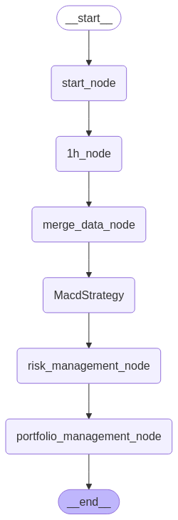
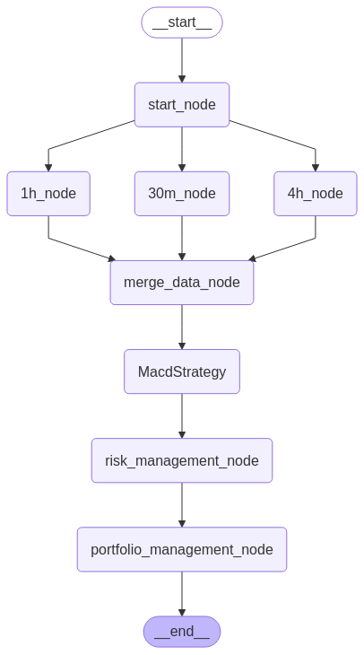
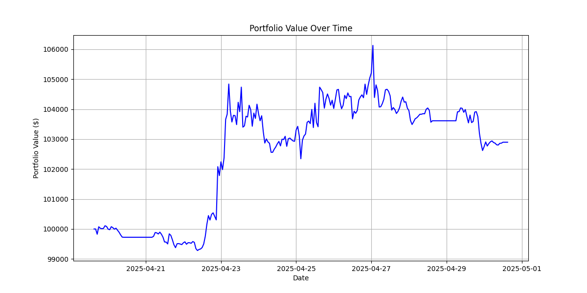

# AI Hedge Fund Crypto

A next-generation algorithmic trading framework that leverages graph-based workflow architecture, 
ensemble technical analysis, and AI language models to make data-driven cryptocurrency trading decisions. 
This system employs a directed acyclic graph (DAG) of specialized nodes for multi-timeframe analysis, 
enabling sophisticated signal generation through weighted combinations of diverse trading strategies.

At its core, the system builds upon LangGraph's computational graph architecture to process market data through 
a pipeline of technical analysis nodes. Each strategy implements a BaseNode interface that processes multi-interval data 
for multiple assets simultaneously. The framework then aggregates these signals using adaptive weighting mechanisms, 
evaluates risk parameters, and formulates position management decisions through large language model (LLM) analysis.

The system stands out through its:
- **AI-Enhanced Decision Making**: Integration of large language models (LLMs) for portfolio management decisions, combining technical signals with sophisticated reasoning
- **Compositional Architecture**: Distinct nodes for data fetching, strategy execution, risk management, and portfolio management
- **Signal Ensemble Approach**: Weighted aggregation of multiple technical strategies (trend following, mean reversion, momentum, volatility, and statistical arbitrage)
- **Multi-Timeframe Analysis**: Simultaneous processing across various time intervals for more robust signal generation
- **Dynamic Strategy Visualization**: Automatic generation of computational graph visualizations to better understand the decision flow
- **Comprehensive Backtesting**: Robust historical performance evaluation with detailed metrics and visualizations

## Architecture

The system is built around a highly configurable directed acyclic graph (DAG) architecture, where data flows through various processing nodes. 
This architecture provides exceptional flexibility, allowing users to customize both the available strategies and the timeframes for analysis without modifying the core code.

### Node-Based Workflow System

At its heart, the system uses LangGraph to create a dynamic computational graph where:

1. **Start Node**: Initializes the workflow and prepares the state for processing
2. **Data Nodes**: Process market data for specific intervals (e.g., 30m, 1h, 4h) 
3. **Strategy Nodes**: Apply technical analysis algorithms to the processed data
4. **Risk Management Node**: Evaluates position limits and exposure
5. **Portfolio Management Node**: Makes final trading decisions using LLM reasoning

The key innovation is that both the data nodes and strategy nodes are fully configurable via the `config.yaml` file, 
allowing you to add, remove, or modify these nodes without changing the core architecture.



### Configurable Timeframes

You can specify multiple timeframes for analysis in your configuration:

```yaml
signals:
  intervals: ["5m", "15m", "30m", "1h", "4h", "1d"]
```

The system will dynamically create separate data processing nodes for each timeframe, allowing strategies to analyze market behavior across multiple time horizons simultaneously. 
This multi-timeframe approach provides more robust signals by capturing both short-term and long-term market trends.



### Configurable Strategies

Similarly, you can specify which trading strategies to include:

```yaml
signals:
  strategies: ['MacdStrategy', 'RSIStrategy', 'BollingerStrategy']
```

The system will dynamically load and integrate only the specified strategies into the workflow graph. Each strategy is implemented as an independent node that:

1. Receives the aggregated multi-timeframe data
2. Applies its specific technical analysis algorithms
3. Generates trading signals with confidence levels
4. Passes these signals to the risk management node

This modular approach allows you to easily experiment with different combinations of strategies without rewriting any code. 
You can also create your own custom strategy modules and add them to the configuration.


### Data Flow Architecture

The complete data flow works as follows:

1. The start node initializes the workflow state
2. Multiple timeframe nodes fetch and process data in parallel for different intervals
3. The merge node combines the multi-timeframe data into a unified state
4. Multiple strategy nodes analyze this unified data and generate signals
5. The risk management node applies position sizing and exposure limits
6. The portfolio management node makes final trading decisions using all available signals and LLM reasoning

This architecture provides several advantages:
- **Flexibility**: Change strategies or timeframes without code modifications
- **Parallelization**: Process multiple timeframes concurrently for improved performance
- **Isolation**: Maintain separation of concerns between different components
- **Extensibility**: Add new strategy nodes without affecting existing functionality
- **Visualization**: Generate visual representations of the workflow for better understanding

## Features

- **Strategy-Based Architecture**: Implement and backtest multiple trading strategies
- **Multi-Timeframe Analysis**: Analyze multiple intervals (1h, 4h, 1d, etc.) simultaneously
- **Multiple Technical Indicators**: MACD, RSI, and custom indicator support
- **Comprehensive Backtesting**: Test strategies against historical data
- **Portfolio Management**: Manage positions with support for both long and short trades
- **Performance Metrics**: Detailed performance statistics and visualization
- **Strategy Visualization**: Automatically generate strategy workflow graphs

## Table of Contents
- [Setup](#setup)
- [Configuration](#configuration)
- [Usage](#usage)
  - [Running Backtest Mode](#running-backtest-mode)
  - [Running Live Mode](#running-live-mode)
- [Creating Custom Strategies](#creating-custom-strategies)
- [Project Structure](#project-structure)
- [Contributing](#contributing)
- [License](#license)
- [Disclaimer](#disclaimer)
- [Referral Links](#referral-links)

## Setup

### Prerequisites
- Python 3.9+
- Binance account (for data access)

### Installation

1. Clone the repository:
```bash
git clone https://github.com/yourusername/ai-hedge-fund-crypto.git
cd ai-hedge-fund-crypto
```

2. Set up using uv (recommended):
```bash
# Install uv if you don't have it
curl -fsSL https://install.lunarvim.org/uv.sh | sh

# Install dependencies using uv
uv pip install -r requirements.txt
# OR use the lockfile
uv pip sync
```

3. Copy the example configuration:
```bash
cp config.example.yaml config.yaml
```

4. Set up environment variables:
```bash
cp .env.example .env
```

5. Add your API keys to the `.env` file:
```
# Binance API keys (required for data access)
BINANCE_API_KEY=your-binance-api-key
BINANCE_API_SECRET=your-binance-api-secret

# LLM API keys (if using AI assistants)
OPENAI_API_KEY=your-openai-api-key
```

## Configuration

The system is configured through the `config.yaml` file. Here's what each setting means:

```yaml
mode: backtest  # Options: backtest, live
start_date: 2025-04-20  # Start date for backtesting
end_date: 2025-05-01  # End date for backtesting
primary_interval: 1h  # Main timeframe for analysis
initial_cash: 100000  # Starting capital
margin_requirement: 0.0  # Margin requirements for short positions
show_reasoning: false  # Whether to show strategy reasoning
show_agent_graph: true  # Whether to show the agent workflow graph
signals:
  intervals: ["30m", "1h", "4h"]  # Timeframes to analyze
  tickers: ["BTCUSDT", "ETHUSDT"]  # Trading pairs
  strategies: ['MacdStrategy']  # Strategies to use
```

## Usage

### Running Backtest Mode

The backtester allows you to test your trading strategies against historical market data.

1. Configure your settings in `config.yaml`:
```yaml
mode: backtest
start_date: 2025-01-01
end_date: 2025-02-01
```

2. Run the backtest:
```bash
uv run backtest.py
```
or 

```bash
uv run main.py
```

This will execute the backtest using the strategies and settings defined in your config file. Results will be displayed in the console and performance charts will be shown.

#### Backtest Results

The backtest generates detailed performance metrics and visualizations:




### Running Live Mode

The system supports two live trading modes: signal generation and real trading execution.

#### Signal Generation Only

For real-time analysis and trading signals without executing actual trades:

1. Configure your settings in `config.yaml`:
```yaml
mode: live
```

2. Run the main script:
```bash
uv run main.py
```

This will fetch current market data, run it through your configured strategies, 
and generate trading signals without sending any orders to exchanges.

#### Real Trading Execution

For live trading with actual order execution on Binance:

1. Configure your settings in `config.yaml`:
```yaml
mode: live
execution: live_trading  # Execute real trades
```

2. Ensure your API keys have trading permissions in your `.env` file:
```
BINANCE_API_KEY=your-binance-api-key-with-trading-permissions
BINANCE_API_SECRET=your-binance-api-secret
```

3. Run the main script:
```bash
uv run main.py
```

The system will use the Binance gateway client to send actual orders to the exchange based on your strategy signals. The gateway module provides an enhanced interface to Binance's API, with similar functionality to `python-binance` but with additional features optimized for algorithmic trading.

> **IMPORTANT**: Live trading involves real financial risk. Start with small amounts and thoroughly test your strategies in backtesting mode before deploying with real capital.

## Creating Custom Strategies

To create a custom strategy, you need to implement the BaseNode interface and define the logic for processing multi-interval data.

## Project Structure

The project is organized into several directories:
- `src`: Contains the main code and modules
- `tests`: Contains unit tests
- `docs`: Contains project documentation

## Contributing

Contributions are welcome! Please read the [CONTRIBUTING.md](CONTRIBUTING.md) file for guidelines on how to contribute to the project.

## License

This project is licensed under the MIT License. See the [LICENSE](LICENSE) file for more information.

## Disclaimer

This project is provided "as is" without any warranty. Use at your own risk.

## Referral Links

If you find this project useful, consider supporting the developers by purchasing a license or referring others to the project.