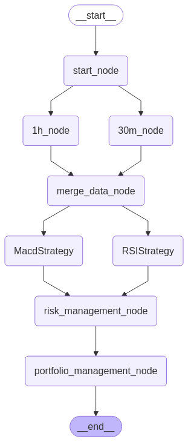
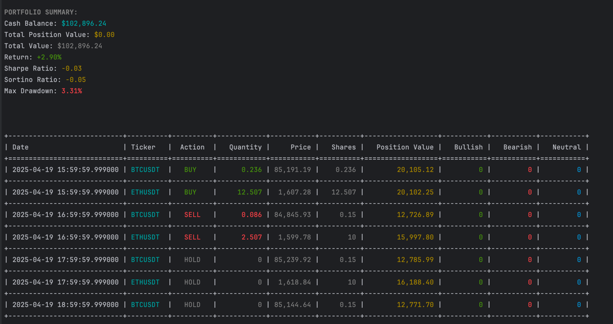

# AI Hedge Fund Crypto

A next-generation algorithmic trading framework that leverages graph-based workflow architecture, 
ensemble technical analysis, and AI language models to make data-driven cryptocurrency trading decisions. 
This system employs a directed acyclic graph (DAG) of specialized nodes for multi-timeframe analysis, 
enabling sophisticated signal generation through weighted combinations of diverse trading strategies.

At its core, the system builds upon LangGraph's computational graph architecture to process market data through 
a pipeline of technical analysis nodes. Each strategy implements a BaseNode interface that processes multi-interval data 
for multiple assets simultaneously. The framework then aggregates these signals using adaptive weighting mechanisms, 
evaluates risk parameters, and formulates position management decisions through large language model (LLM) analysis.

The system stands out through its:
- **AI-Enhanced Decision Making**: Integration of large language models (LLMs) for portfolio management decisions, combining technical signals with sophisticated reasoning
- **Compositional Architecture**: Distinct nodes for data fetching, strategy execution, risk management, and portfolio management
- **Signal Ensemble Approach**: Weighted aggregation of multiple technical strategies (trend following, mean reversion, momentum, volatility, and statistical arbitrage)
- **Multi-Timeframe Analysis**: Simultaneous processing across various time intervals for more robust signal generation
- **Dynamic Strategy Visualization**: Automatic generation of computational graph visualizations to better understand the decision flow
- **Comprehensive Backtesting**: Robust historical performance evaluation with detailed metrics and visualizations

## Architecture



## Features

- **Strategy-Based Architecture**: Implement and backtest multiple trading strategies
- **Multi-Timeframe Analysis**: Analyze multiple intervals (1h, 4h, 1d, etc.) simultaneously
- **Multiple Technical Indicators**: MACD, RSI, and custom indicator support
- **Comprehensive Backtesting**: Test strategies against historical data
- **Portfolio Management**: Manage positions with support for both long and short trades
- **Performance Metrics**: Detailed performance statistics and visualization
- **Strategy Visualization**: Automatically generate strategy workflow graphs

## Table of Contents
- [Setup](#setup)
- [Configuration](#configuration)
- [Usage](#usage)
  - [Running Backtest Mode](#running-backtest-mode)
  - [Running Live Mode](#running-live-mode)
- [Creating Custom Strategies](#creating-custom-strategies)
- [Project Structure](#project-structure)
- [Contributing](#contributing)
- [License](#license)
- [Disclaimer](#disclaimer)
- [Referral Links](#referral-links)

## Setup

### Prerequisites
- Python 3.9+
- Binance account (for data access)

### Installation

1. Clone the repository:
```bash
git clone https://github.com/yourusername/ai-hedge-fund-crypto.git
cd ai-hedge-fund-crypto
```

2. Set up using uv (recommended):
```bash
# Install uv if you don't have it
curl -fsSL https://install.lunarvim.org/uv.sh | sh

# Install dependencies using uv
uv pip install -r requirements.txt
# OR use the lockfile
uv pip sync
```

3. Copy the example configuration:
```bash
cp config.example.yaml config.yaml
```

4. Set up environment variables:
```bash
cp .env.example .env
```

5. Add your API keys to the `.env` file:
```
# Binance API keys (required for data access)
BINANCE_API_KEY=your-binance-api-key
BINANCE_API_SECRET=your-binance-api-secret

# LLM API keys (if using AI assistants)
OPENAI_API_KEY=your-openai-api-key
```

## Configuration

The system is configured through the `config.yaml` file. Here's what each setting means:

```yaml
mode: backtest  # Options: backtest, live
start_date: 2025-04-20  # Start date for backtesting
end_date: 2025-05-01  # End date for backtesting
primary_interval: 1h  # Main timeframe for analysis
initial_cash: 100000  # Starting capital
margin_requirement: 0.0  # Margin requirements for short positions
show_reasoning: false  # Whether to show strategy reasoning
show_agent_graph: true  # Whether to show the agent workflow graph
signals:
  intervals: ["30m", "1h", "4h"]  # Timeframes to analyze
  tickers: ["BTCUSDT", "ETHUSDT"]  # Trading pairs
  strategies: ['MacdStrategy']  # Strategies to use
```

## Usage

### Running Backtest Mode

The backtester allows you to test your trading strategies against historical market data.

1. Configure your settings in `config.yaml`:
```yaml
mode: backtest
start_date: 2025-01-01
end_date: 2025-02-01
```

2. Run the backtest:
```bash
uv run backtest.py
```
or 

```bash
uv run main.py
```

This will execute the backtest using the strategies and settings defined in your config file. Results will be displayed in the console and performance charts will be shown.

#### Backtest Results

The backtest generates detailed performance metrics and visualizations:




### Running Live Mode

For real-time analysis and trading signals (no actual trading):

1. Configure your settings in `config.yaml`:
```yaml
mode: live
```
for the real trading and send order to the Binance exchange, you can use the client from gateway, it's all most the same 
usage with `python-binance` but with some functions enhancement.


2. Run the main script:
```bash
uv run main.py
```